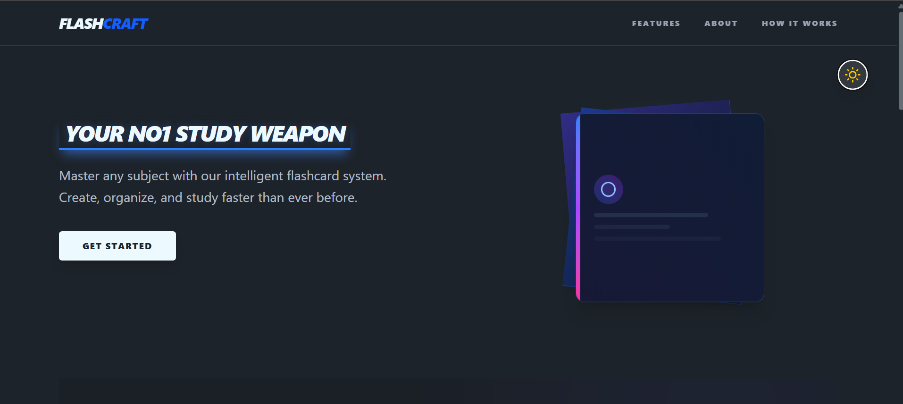
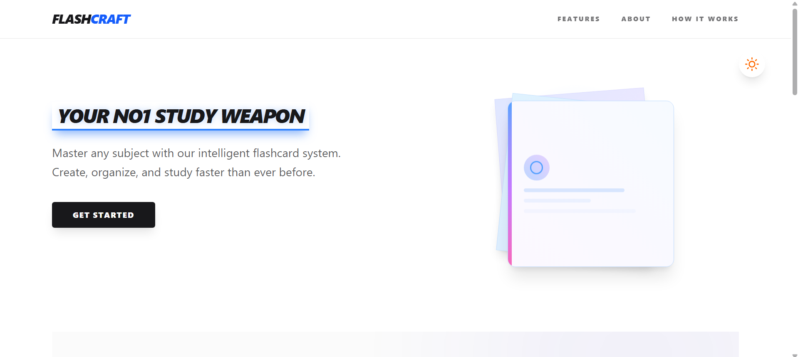
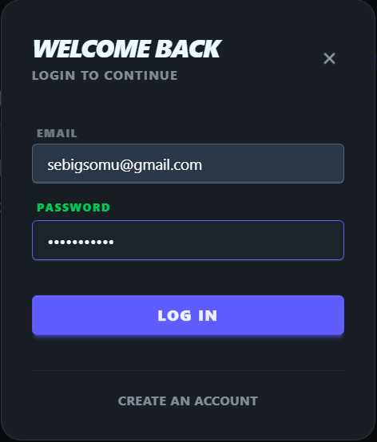
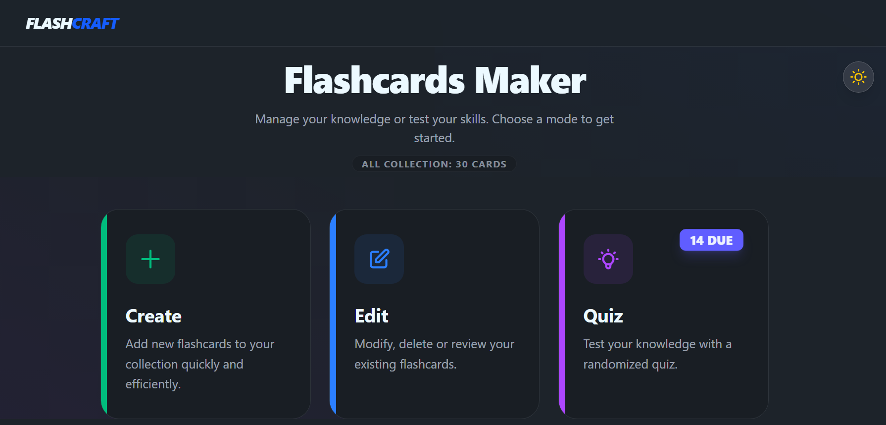
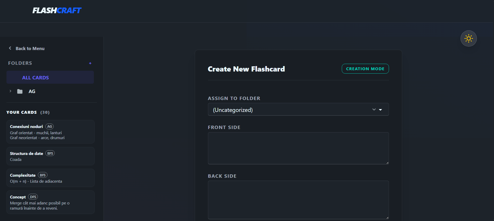
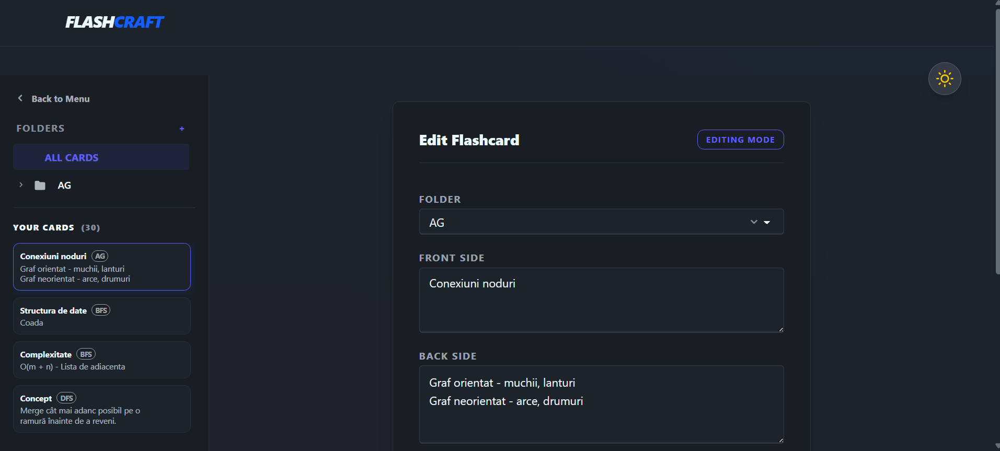
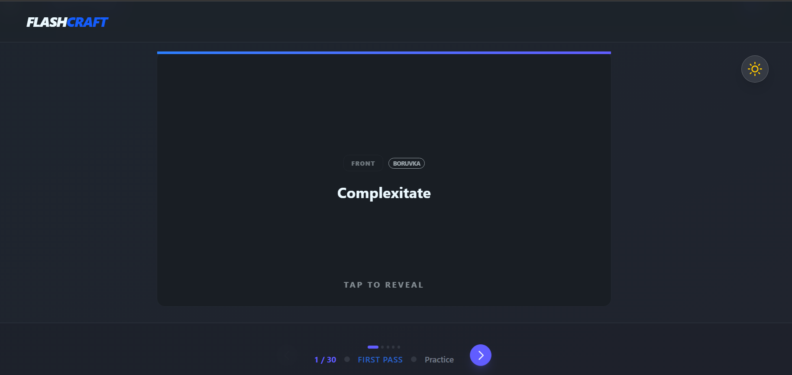
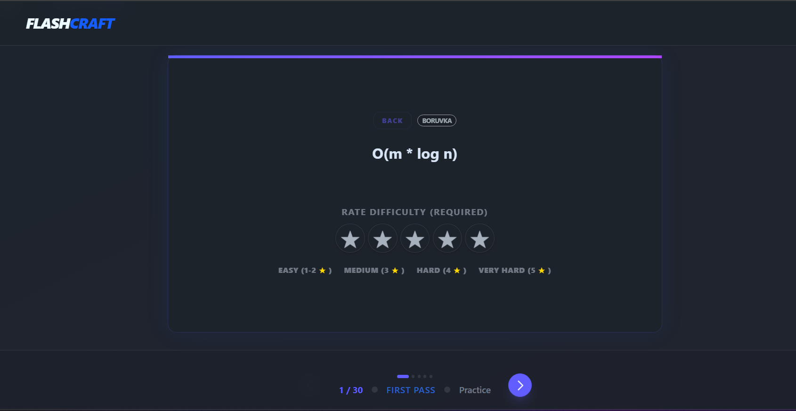

# FlashCraft - Study Smarter, Not Harder

[](https://reactjs.org/)
[](https://go.dev/)
[](https://gofiber.io/)
[](https://www.sqlite.org/)
[](https://tailwindcss.com/)

**FlashCraft** is a high-performance, full-stack application designed to help students and professionals master any subject using an intelligent Spaced Repetition System (SRS). Built with a focus on speed, refined UI/UX, and security.

---

## Features

- **Frontend Excellence**: Built with **React 18**, **TypeScript**, and **Framer Motion** for smooth 3D card flips and a cinematic user experience.
- **Intelligent SRS**: Integrated **SM-2 Algorithm** that dynamically schedules reviews based on your memory performance.
- **Go Backend**: High-performance **Go (Fiber)** server providing sub-millisecond API responses and robust routing.
- **Database Power**: **SQLite** storage with **GORM**, ensuring data integrity for flashcards, folders, and SRS metrics in a portable file.
- **Security First**: JWT-based authentication, Bcrypt password hashing, and built-in rate-limiting protection.
- **Theming**: Seamless **Dark and Light mode** support using Tailwind CSS and DaisyUI.

---

## Visual Showcase

| Home Page (Dark) | Home Page (Light) |
| :---: | :---: |
|  |  |

| Authentication | Dashboard View |
| :---: | :---: |
|  |  |

| Create Flashcard | Edit Flashcard |
| :---: | :---: |
|  |  |

| Study Mode (Question) | Study Mode (Rating) |
| :---: | :---: |
|  |  |

---

## Tech Stack

### Frontend
- **React 18 & TypeScript** - Foundation of the UI logic.
- **Vite** - Lightning-fast build tool and development server.
- **Tailwind CSS & DaisyUI** - Utility-first styling with a rich component library.
- **React Query** - Robust server state management.
- **Framer Motion** - Cinematic 3D animations.
- **Zustand** - Global state for authentication.

### Backend
- **Go (Golang)** - Core language for performance.
- **Fiber v2** - Express-like web framework for Go.
- **SQLite** - Durable, zero-config relational database.
- **GORM** - Developer-friendly ORM for database operations.
- **JWT & Bcrypt** - Industry-standard security layers.

---

## Getting Started

### Prerequisites
- [Node.js](https://nodejs.org/) (v18+)
- [Go](https://go.dev/) (v1.20+)

### Backend Setup
1. Navigate to the backend directory:
   ```bash
   cd backend
   ```
2. Create your `.env` file:
   ```bash
   cp .env.example .env
   ```
3. Run the server:
   ```bash
   go run .
   ```

### Frontend Setup
1. Navigate to the root directory:
   ```bash
   npm install
   ```
2. Create your `.env` file (if needed):
   ```bash
   cp .env.example .env
   ```
3. Start the development server:
   ```bash
   npm run dev
   ```

---

## License
Distributed under the MIT License. See `LICENSE` for more information.

---

Designed with heart for lifelong learners.

